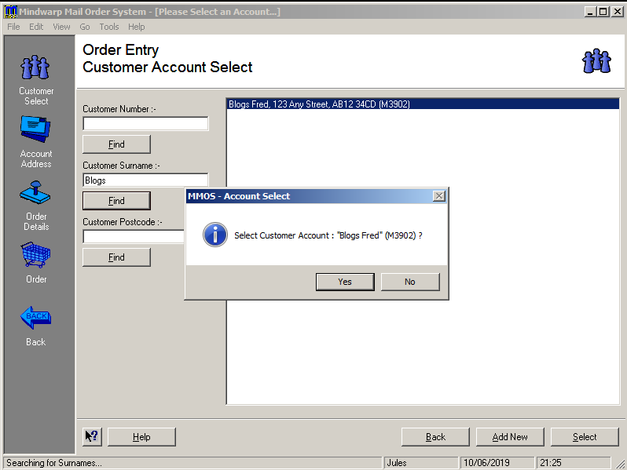

# MMOS
MMOS
====

   

MMOS (which is an abbreviation for Mindwarp Mail Order System) was developed for a client to help them through their Y2K issues with their existing system.

Written by [Jules Moorhouse](https://www.julesmoorhouse.com).

# What is MMOS ?

MMOS is a mail order system, designed before the internet. Therefore it was used to process paper and telephone orders. The whole process from input of orders, selection of products, payments, advice note creation, order packing and reporting. MMOS is designed for different types or users and offers user levels to cater for each.

# Repository Structure

This project is split among several repositories, one for each program, one for help files / databases and another some common code. The common code repo is added to each of the program repos with git subtree. This makes it easier to make changes to the common code without having to create a separate DLL.

Now I'll discuss the different programs, in the order than you'll need / use them.

## Configure (Configure.exe)
https://github.com/JulesMoorhouse/MMOS-Configure

I wrote the Configure program in 2019, previously with my client setup and configuration was done manually. Later this upgraded were performed to streamline this process, so became more complex.

The basic concept of the program is to copy files into a server folder, create a settings file and reattach linked tables.

The configuration program can also be used to create development specific settings files.

## Client (MMOS.exe)
https://github.com/JulesMoorhouse/MMOS-Client

The client program is the core program in the whole MMOS suite.

The following content has been taken from the MMOS Client help file.

### ORDER ENTRY
Normal use of the system is accessed from Order Entry. You will first try and find the customer in the system database then select or create the customer. The selection screen allows selection by various criteria. You can then add information about payments and add products to the order. 

### ORDER ENQUIRY
Following the entry of an order a facility to allow amendments has been provided. Initially as with order entry the customer selection screen will be shown, then the 'Order History' screen showing all orders, all products within each order and any cash book entries. 

### ACCOUNT MAINTENANCE
As with the first two options the 'Customer Account Selection' screen is shown. Next the account amendment screen. Customer details should be maintained from here. 

### FINANCE
This option has been provided to deal with customer cheques etc. As the system automatically generates discrepancy records when required, the facility to maintain monies was provided. 

### PACKING
To continue in the next logical step after 'Order Entry' the packing screen provides a means where you can modify dispatch quantities (if out of stock). This screen also automatically confirms (after you click the 'Confirm' button) the order and recalculates the order totals if the dispatch quantities are altered. The process also generates discrepancy records that can be accessed from the 'Cheque' screen. 

### ORDER MAINTENANCE
Various features have been created here to cater for user error and discrepancies. This screen is aimed at the customer service manager. 

Here's a selection of screenshots from the MMOS program.

For more details please see the full MMOS Client help file.
https://github.com/JulesMoorhouse/MMOS-Shared/blob/master/Help/Client/MMOS.chm?raw=true

## Loader (Loader.exe)
https://github.com/JulesMoorhouse/MMOS-Loader

The loader program is called with a shortcut parameter to load and run all the MMOS programs. Files are copied / pull down from the server folder. Also checks for required system files are also performed.

The idea behind this is to allow for programs to be updated and easily deployed. The loader will check for new files and copy them before running them.

The loader program is displayed as a small blue bar on the top left of the screen.

## Minder (Minder.exe)
https://github.com/JulesMoorhouse/MMOS-Minder

Minder is a simple Windows clean up program to delete windows temporary files. It will delete yesrerdays files and older.

The program runs when MMOS, MAdmin or MReps programs end.

The Minder program is dispplayed as a small red bar on the top left of the screen.

## Admin (MAdmin.exe) / Maintenance
https://github.com/JulesMoorhouse/MMOS-Admin

The admin program is aimed at managers and IT staff, it allows changes to be made to static / reference data. Also basic product / stock management. Also most importantly user management, where you can give users higher rights to the system.

Here's a selection of screenshots from the Admin program.

## Reps (MReps.exe) / Manager
https://github.com/JulesMoorhouse/MMOS-Reps

Since the "Reps" or reporting program was first written, it evolved into a multi functional program aimed at staff who act in a supporting capacity.

As well as providing a wide range of reports in several different formats, it also provides aggregated data for finiancial staff. 

Also it provides functionaliy for staff for distribute packages.

Another feature which was added, was to manage duplicate customers, aimed at managers and supervising order entry clerks.

Here's a selection of screenshots from the Reps program.

## Common 
https://github.com/JulesMoorhouse/MMOS-Common

The MMOS-Common repository is used a subtree for several of the MMOS programs. The idea behind this provide easy ass to source files within each project, rather than as a DLL, making modifications easier. VB6 DLLs can be difficult to deal with.

## Shared 
https://github.com/JulesMoorhouse/MMOS-Shared

The MMOS-Shared repository contains the databases and help files required by MMOS. It also contains some batch files, which allows all of the programs to be built. These are useful if you make changes to the common code subtree repository.

I've included three help files, the client help file is complete.

However the other two help files aren't finished. I do have some html help pages which need contverting to the chm format, but this would be a manual process.

## Other programs

I also have a warehouse program which was used by my client, however I haven't uploaded this to GitHub, if you are interested in seeing it, please file an issue. Many years ago I started developing a "Lite" version of MMOS, with the intention of it becoming a downloadable app. However it was never completed, therefore I haven't added that to GitHub either, again let me know if you are interested.

# Installation

Firstly download and unzip the Configure-Package.zip file, install the setup program and open the MMOS Configure program.

Follow the instructions in the configuration program.

# Development

To setup MMOS for development you'll need clone several repositories in a certain folder stucture.
If you wish to contribute to the project and make changes you'll also need to setup a sub-tree in each folder (so you can access common code).

Firstly create a folder, we'll assume you're using tha folder later in these instructions, e.g. 
~~~~
D:\mmos-github 
~~~~

From the command line, cd into that folder and run the following commands, the folders at the end are important!

~~~~
git clone https://github.com/JulesMoorhouse/MMOS-Admin.git Admin
git clone https://github.com/JulesMoorhouse/MMOS-Client.git Client
git clone https://github.com/JulesMoorhouse/MMOS-Configure.git Configure
git clone https://github.com/JulesMoorhouse/MMOS-Loader.git Loader
git clone https://github.com/JulesMoorhouse/MMOS-Minder.git Minder
git clone https://github.com/JulesMoorhouse/MMOS-Reps.git Reps
~~~~

Now cd into each folder in turn and run the following command.

~~~~
git subtree add --prefix=common https://github.com/JulesMoorhouse/MMOS-Common.git master
~~~~

Then run the following command line from the D:\mmos-github folder.

~~~~
git clone https://github.com/JulesMoorhouse/MMOS-Shared.git Shared
~~~~

You'll now need install Visual Basic 6 and the last service pack, these are available to download from MSDN.

Now download Mouse Wheel fix from the Microsoft support site.

Open Visual Basic 6 and add the Mouse Wheel fix add-in.

To build MMOS and all of it's projects, run :-
~~~~
D:\mmos-github\Shared\BatchFiles\BuildAll.bat
~~~~

To build the MMOS Configuration program you'll need to run :-
~~~~
D:\mmos-github\Configure\Package\Build.bat 
~~~~
Then follow the instructions presented.

To build the MMOS Client setup you'll need to run  :-
~~~~
D:\mmos-github\Client\Package\Build.bat 
~~~~
Also, then follow the instructions presented.

# Contributing
Contributions for bug fixing or improvements are welcomed. Feel free to submit a pull request. If you would like to create an issue, please do so here rather than the separate program repos (in fact this has been disabled).

# License
Usage is provided under the [MIT License](http://opensource.org/licenses/mit-license.php). See LICENSE for the full details.
